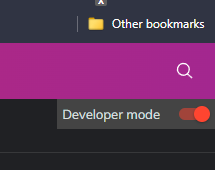
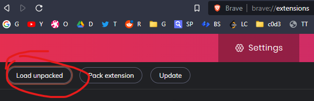
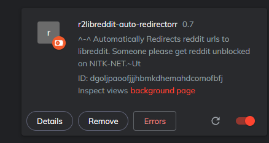

# r2libreddit-auto-redirector

Auto redirects reddit links to libredd.it . :)

---

## To use the extension in Chromium based browsers (chrome, brave, edge, etc)

Clone the repo:

```sh
git clone https://github.com/Utkar5hM/r2libreddit-auto-redirector.git
```

open [chrome://extensions/](chrome://extensions/).

Enable "Developer mode" if it's not enabled yet:



Click on "Load unpacked":



select the cloned repository's directory on your system and open it.

The extension should be now at the top of the page:



### Tada, It should start working. :)
